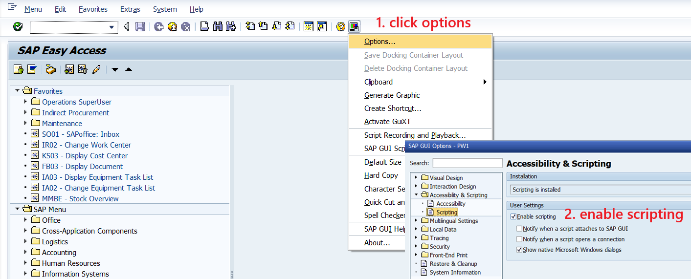

# Schichtbuch → SAP Sync (VBScript)

Automate the double work of logging maintenance tasks twice: once in the [**shift logbook excel**](Muster_2026_Schichtbuch.xlsx) and again in **SAP**.  
This VBScript scans the [**shift logbook excel**](Muster_2026_Schichtbuch.xlsx), identifies entries not yet processed in SAP, and **confirms, completes, or cancels** the corresponding SAP work orders (using T-codes IW41 / IW32), either fully automatically or with user confirmations.

> 🧑‍🏭 Typical users: Maintenance & Reliability (M&R) planners, supervisors, managers

> ⚙️ Runs on: Windows, SAP GUI for Windows (with scripting), Microsoft Excel

---

## Table of contents

- [Flowchart](#flowchart)
- [Features](#features)
- [How it works](#how-it-works)
- [Prerequisites](#prerequisites)
- [Installation](#installation)
- [Command-line usage](#command-line-usage)
- [Parameter details](#parameter-details)
- [Run examples](#run-examples)
- [Logging](#logging)
- [Excel layout & data mapping](#excel-layout--data-mapping)
- [Safety checks & guardrails](#safety-checks--guardrails)
- [Known limitations](#known-limitations)
- [Troubleshooting](#troubleshooting)

---

## Flowchart


---

## Features

- 🔍 **Reads the [shift logbook excel](Muster_2026_Schichtbuch.xlsx)** in bulk (fast, minimal COM calls)
- 👷 **Maps employee names → SAP personnel numbers** from another sheet (can use lenient name matching)
- 🕒 **Converts Excel time fractions** into proper timestamps and correctly handles **overnight work**
- 🌍 Ensures all timestamps are **UTC** (using Windows ActiveTimeBias registry entry)
- 🗃️ **Confirms work orders** in IW41 including short texts, work duration, start/end, and final confirmation settings
- ❌ **Cancels orders** in IW32 when the [shift logbook excel](Muster_2026_Schichtbuch.xlsx) marks them as cancelled
- 🧹 **Completes (TECO)** work orders when the [shift logbook excel](Muster_2026_Schichtbuch.xlsx) marks them as complete
- 📄 **Writes back results** to the Excel (column 16) only if no existing message is present
- 🔁 **Optional helper:** copies upcoming PMs from **IW38** into the Excel (layout-dependent)
- 🛡️ Robust SAP wrappers (`SafeFindById`, `SafeSetText`, `SafeSendVKey`, etc.)  
- 🪵 **Detailed log files** in `./logs/`

---

## How it works

1. Script initializes logging, reads runtime arguments, loads timezone offset.
2. Determines which Excel file to open based on:
   - `filePath` argument
   - OR `useCurrentExcel=yes` (builds SharePoint path)
   - OR file-open dialog (default)
3. Excel is opened; content is bulk-read for performance.
4. Each row is validated and processed:
   - Checks WO, employee, status, times
   - Cancels orders in IW32 when needed
   - Determines SAP status and skip-conditions
   - Confirms WOs via IW41 for one or multiple employees
   - Performs TECO if needed
5. Writes result messages to column 16
6. Logs everything and exits cleanly

---

## Prerequisites

- Windows with **Windows Script Host (WSH)**
- SAP GUI 7.x+ with **scripting enabled** (client + server)
- Microsoft Excel installed
- SAP access to IW32, IW33, IW38, IW41 & to the corresponding work orders
- IW38 helper requires ALV layout with **technical field names**

---

## Installation

1. Place these files in the same directory:
   - [`Schichtbuch script.vbs`](Schichtbuch%20script.vbs)
   - [`SAP Login.vbs`](SAP%20Login.vbs)
2. Ensure folder is writable (script creates `./logs/`)
3. Ensure SAP GUI scripting is enabled:
   
5. Run the script
   - from [command-line](#command-line-usage) or
   - import the [windows task](shift%20logbook%20script%20windows%20task.xml) to the windows task scheduler to let the script run automatically (e.g. every day at 2PM)

---

## Command-line usage

```
cscript //nologo "Schichtbuch script.vbs" [filePath=<path_or_url>] [autoConfirm=yes|no] [useCurrentExcel=yes|no]
```

---

## Parameter details

### `filePath`
**Default:** not provided
**Behavior:**
- If filePath provided: Uses <path_or_url> e.g. filePath="C:\Data\Schichtbuch.xlsx"
- If no filePath provided:
   - If `useCurrentExcel=yes` → script builds current-month SharePoint path (specific to Berlin)
   - Otherwise → shows Excel file-open dialog so user can select a file

### `autoConfirm`
**Default:** not provided - script asks user once at the beginning of script run:
**Behavior:**
- `yes` → automatic confirmations to SAP
- `no`  → ask before each confirmation to SAP (user can click yes, no or cancel)

### `useCurrentExcel`
**Default:** not provided - interpreted as `no`
**Behavior:**
- `yes` → build SharePoint path for current month's Schichtbuch
- `no`  → normal file selection process

---

## Run examples

### Fully automatic (Auto-select current month, specific to Berlin plant)
```
cscript //nologo "Schichtbuch script.vbs" useCurrentExcel=yes autoConfirm=yes
```

### Fully automatic (using a provided filePath, e.g. when you want to run the script on an older month's shift logbook)
```
cscript //nologo "Schichtbuch script.vbs" filePath="C:\Data\Schichtbuch.xlsx" autoConfirm=yes
```

### Interactive (asks user about everything, very slow, good for debugging)
```
cscript //nologo "Schichtbuch script.vbs"
```

---

## Logging

Stored in `./logs/<script>_<user>_<timestamp>.log`.

---

## Excel layout & data mapping

### Sheet 1 (Schichtbuch)

| Column | Description |
|--------|-------------|
| 1 | Tag (Date) |
| 3 | WO_Nr (must be 9 digits) |
| 5 | Employee(s) separated by `/` |
| 7 | WO Title |
| 8 | Fehlerbeschreibung (what's wrong?) |
| 9 | Massnahme (what was done?) |
| 10 | Startzeit (start time) |
| 11 | Endzeit (finish time) |
| 12 | DauerInH (duration) |
| 15 | Status (state, matches sheet 2) |
| 16 | Script output message |
| 17 | Operation in SAP WO (optional) |

### Sheet 2 (Mappings)

- Column A: Employee name
- Column B: Personnel number
- Cell E4: "done" text
- Cell E5: "cancelled" text

---

## Safety checks & guardrails

- Hard skip conditions: missing WO, wrong WO format, message already present, status missing
- Soft skips: missing employee, missing times, invalid conversions
- SAP skip conditions: purchases found, multiple operations
- SAP wrappers abort cleanly on layout or scripting errors

---

## Known limitations

- SAP GUI layout differences require adjustments
- IW38 helper depends on technical ID layout
- Massnahme truncated to 40 chars
- Buffered writes disabled for reliability

---

## Troubleshooting

### SAP object not found
Check SAP GUI scripting and correct transaction screen.

### Employee not found
Add employee + personnel number to sheet 2.

### Time wrong
Ensure Excel uses real time values or fractions.
